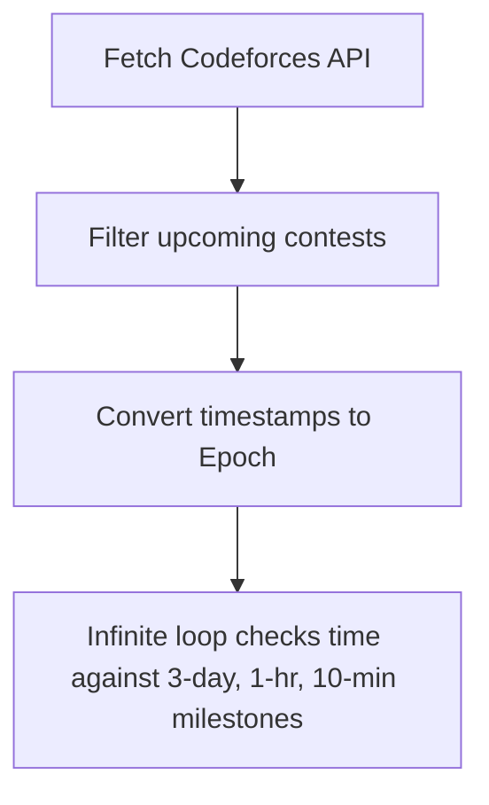
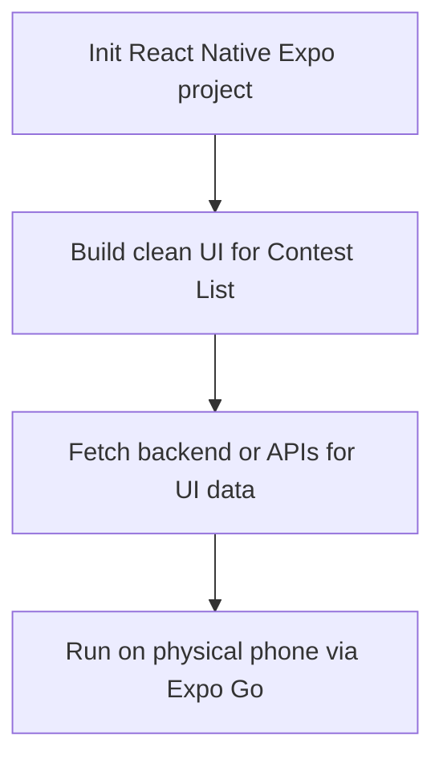
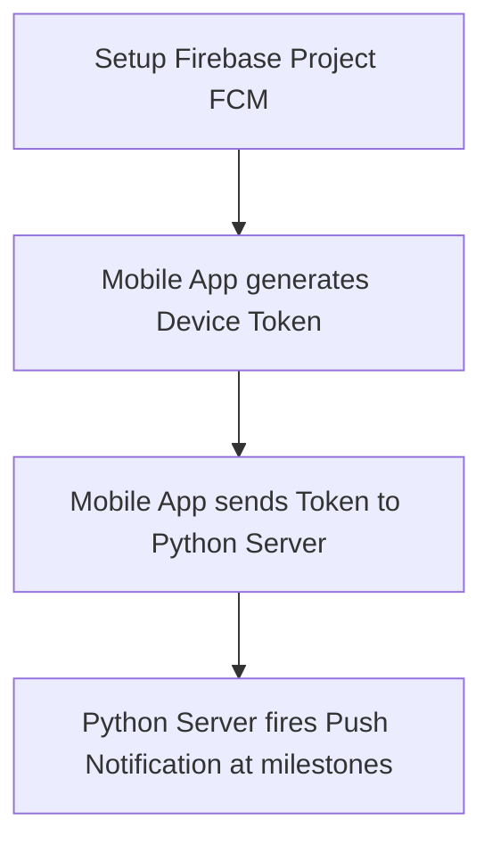
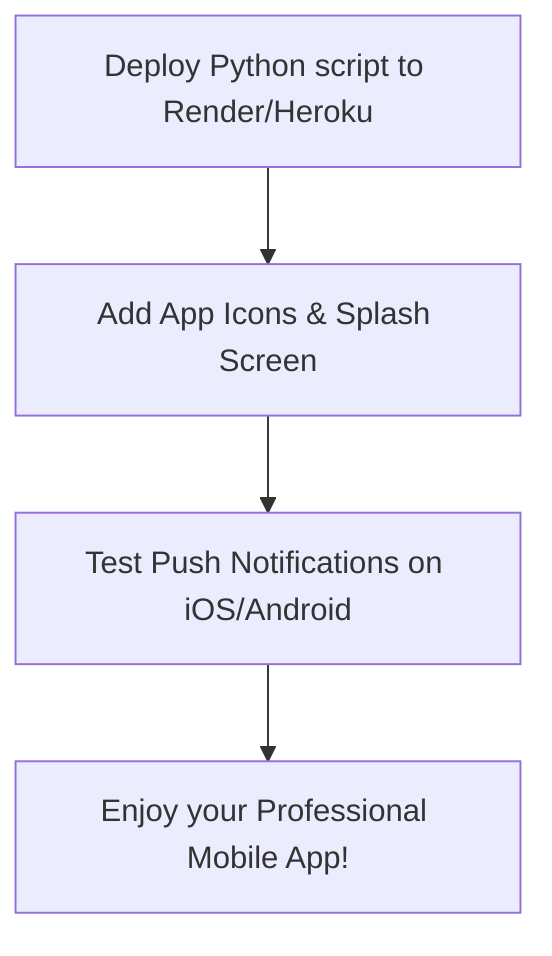

# Architecture and Implementation Flow

## 🏛️ Architecture Overview
- **Path Selected**: Architecture 2 (Python Backend + Mobile App Frontend).
- **How it works**:
  - **Backend**: A Python daemon runs 24/7 on a cloud server (like Render/Heroku). It monitors coding contest schedules and does the heavy lifting.
  - **Middleman**: Firebase Cloud Messaging (FCM) routes push notifications to the devices.
  - **Frontend**: A React Native (Expo) mobile app receives the push notifications and displays a beautiful UI of upcoming contests on iOS and Android.
- **Data Sources (APIs)**:
  - Codeforces Official API (`codeforces.com/api/contest.list`)
  - CLIST API (For LeetCode/CodeChef)

## 🗺️ Implementation Flow

### Phase 1: The Python Backend (Days 1-4) ✅
- **Goal**: Build the brain that monitors the time.

### Phase 2: The Mobile App Frontend (Days 5-6)
- **Goal**: Create the React Native mobile app.

### Phase 3: Wiring up Push Notifications (Days 7-8)
- **Goal**: Connect the Python brain to the mobile phone.

### Phase 4: Polish & Cloud Deployment (Days 9-10)
- **Goal**: Deploy the server and polish the app.

