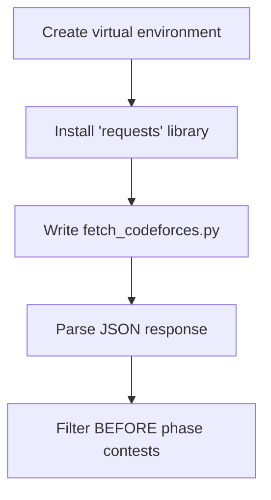
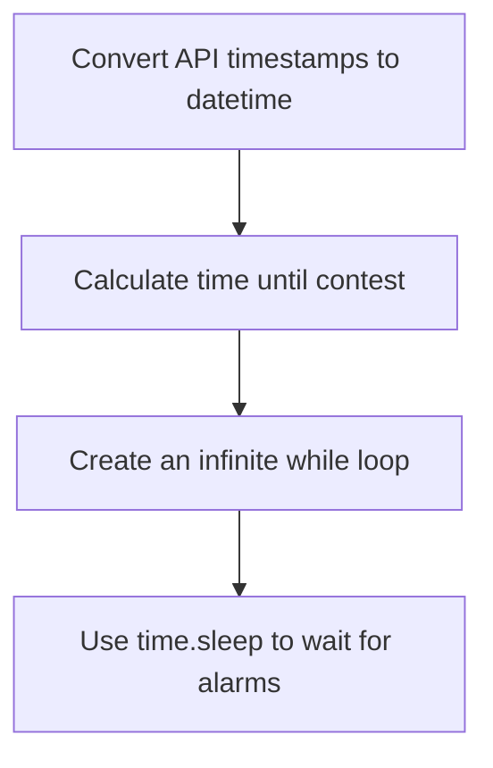
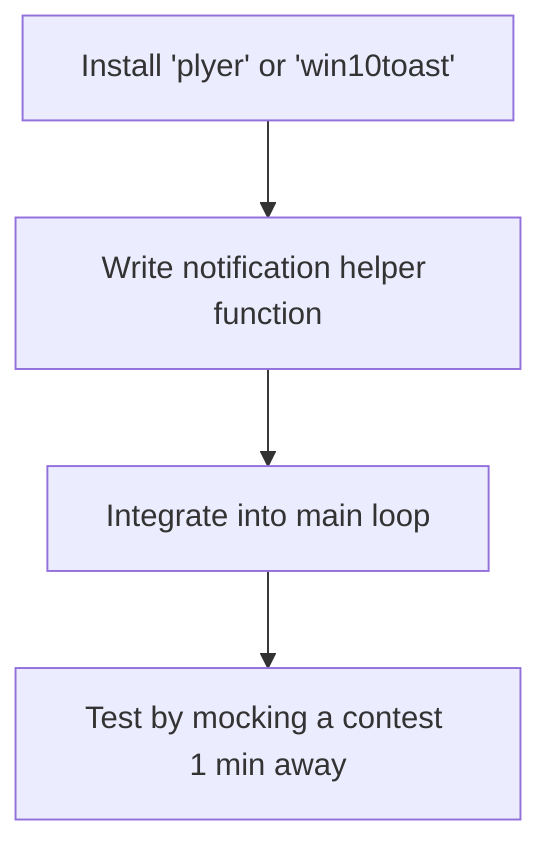
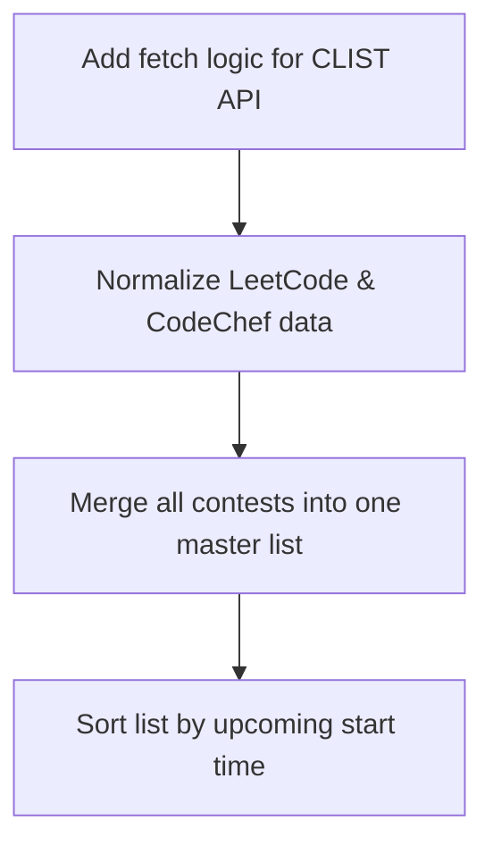
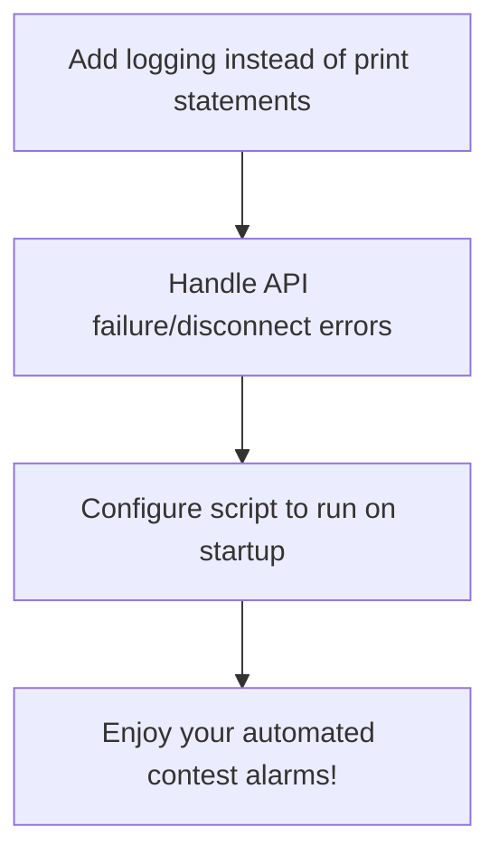

# Architecture and Implementation Flow

## 🏛️ Architecture Overview
- **Path Selected**: Pure Python Desktop App. No browser extension or JavaScript required.
- **How it works**: A Python script runs continuously in the background on your OS. It fetches contest data, calculates when the next contest is, and uses native OS libraries to pop up a desktop notification.
- **Data Sources (APIs)**:
  - Codeforces Official API (`codeforces.com/api/contest.list`)
  - CodeChef Public JSON (`codechef.com/api/list/contests/all`)
  - CLIST API (Recommended for LeetCode/CodeChef to aggregate and normalize timestamps)

## 🧠 Why We Used What We Used
- **Why Python?** Python is fantastic for backend scripting and data manipulation. It allows you to focus purely on the logic without worrying about browser sandbox restrictions or Manifest V3 rules.
- **Why `plyer` / `win10toast`?** These libraries allow Python to trigger native notifications (like the Windows Action Center). It looks professional and integrates directly with the OS.
- **Why a background script?** Unlike an extension which relies on the browser being open, a desktop app runs silently in the background as long as your computer is on, making it a reliable daemon process.

## 🗺️ 10-Day Implementation Flow

### Day 1–2: The Foundation & Codeforces
- **Goal**: Set up the Python environment and fetch real data.

### Day 3–4: Time Math & Scheduling
- **Goal**: Calculate accurate start times and build the main loop.

### Day 5–6: Desktop Notifications
- **Goal**: Make your OS alert you.

### Day 7–8: Adding More Judges
- **Goal**: Expand data sources.

### Day 9–10: Polish & Background Execution
- **Goal**: Make it run silently and smoothly.

